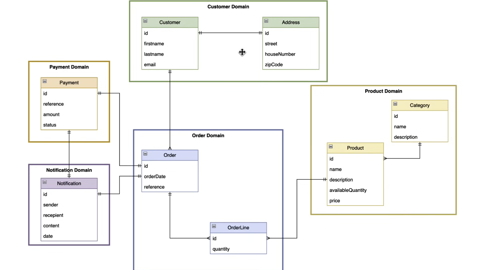
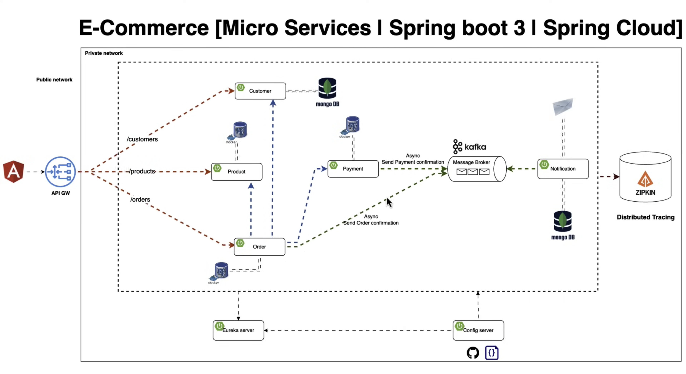
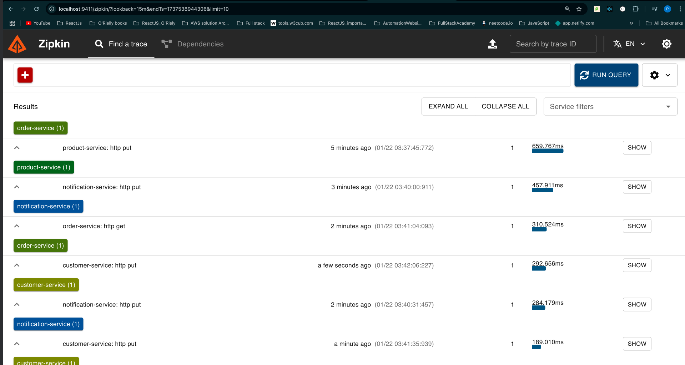

# E-Commerce_Microservices_SpringBoot

[//]: # (![Image1]&#40;path/to/image&#41;)

 # FeignClient : 
    - FeignClient is a declarative HTTP client in Spring Cloud that simplifies communication between microservices.
    - It abstracts the complexities of making REST API calls by providing an easy-to-use interface to define HTTP requests.
 # Eureka Server client
    - In a Spring Boot microservices architecture, the Eureka Server acts as a service registry, and the Eureka Client is any microservice or application that registers itself with the Eureka Server for service discovery. 
    - This allows microservices to dynamically locate and communicate with each other without hardcoding their locations.

